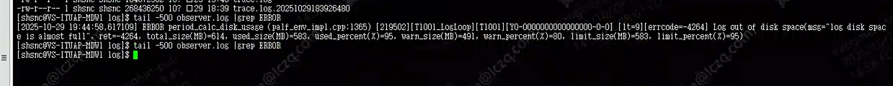

## ocp_express 组件无法启动

**参考链接：**[https://ask.oceanbase.com/t/topic/35614966](https://ask.oceanbase.com/t/topic/35614966)

**主要日志：**<font style="color:#DF2A3F;">Log out of disk space(msg="log disk space is almost full", ret=4264, total_size(MB)=614, used_sieze(MB)=583, used_percent(%)=95, warn_size(MB)=491, warn_percent(%)=80, limit_size(MB)=583, limit_percent(%)=95)</font>



**问题原因:** 日志磁盘空间不足，使用了已经到达预设的警戒线，无法写入新的日志，导致服务不可用

**解决方法:** 通过 obclient 登录，修改故障节点的配置，增加日志空间

```sql
ALTER RESOURCE UNIT <unit_config_name>
[CPU = <cpu_num>,]
[MEMORY_SIZE = '<memory_size>',]
[LOG_DISK_SIZE = '<log_disk_size>',]
[MAX_CPU = <max_cpu_num>,]
[MIN_CPU = <min_cpu_num>,]
[IOPS_WEIGHT = <iops_weight>,];

# unit_config_name> 通过两面两条sql语句查询对应的
SELECT * FROM DBA_OB_RESOURCE_POOLS; # 查询UNIT_ID
SELECT * FROM oceanbase.DBA_OB_UNIT_CONFIGS\G # 查询UNIT_ID对应的UNIT_CONFIG_NAME

# 修改对应的UNIT_CONFIG_NAME的LOG_DISK_SIZE配置
ALTER RESOURCE UNIT ocp_unit LOG_DISK_SIZE=6442450944;
```

**其他 SQL**

```sql

# 查看租户资源分布
select a.zone,a.svr_ip,b.tenant_name,b.tenant_type, a.max_cpu, a.min_cpu,
round(a.memory_size/1024/1024/1024,2) memory_size_gb,
round(a.log_disk_size/1024/1024/1024,2) log_disk_size,
round(a.log_disk_in_use/1024/1024/1024,2) log_disk_in_use,
round(a.data_disk_in_use/1024/1024/1024,2) data_disk_in_use
from oceanbase.gv$ob_units a join oceanbase.dba_ob_tenants b on a.tenant_id=b.tenant_id order by b.tenant_name;

# 查看参数配置
show parameters where name in (‘memory_limit’,‘memory_limit_percentage’,‘system_memory’,‘log_disk_size’,‘log_disk_percentage’,‘datafile_size’,‘datafile_disk_percentage’);
```
